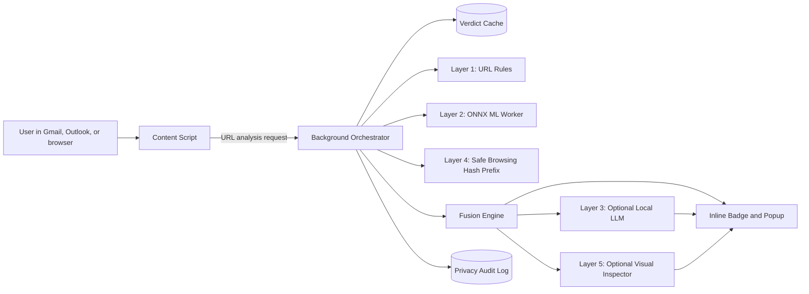

# Gorgon Eye

Privacy-preserving phishing defense for the browser.

Gorgon Eye is a local-first browser extension that detects phishing at the point of attack — inside webmail and while browsing — without sending email content or full URLs to any cloud service. The core promise: email content never leaves the device, full scanned URLs are not sent to any external service, and every optional network call is auditable by the user in one click.

## What Gorgon Eye Does

Gorgon Eye protects users from phishing by stacking multiple local and privacy-preserving detection layers:

- **Rule-based URL forensics** — ten deterministic checks for obvious phishing patterns, running in under 10 ms with no network calls.
- **Local ML inference** — an offline-trained XGBoost model exported to ONNX and executed in the browser via ONNX Runtime Web. Zero cloud calls for ML.
- **Privacy-preserving threat intelligence** — Google Safe Browsing's hash-prefix protocol, so only a 4-byte hash prefix (not the full URL) ever leaves the device.
- **Optional local LLM explanations** — WebLLM (SmolLM2-1.7B, q4f32) generates plain-English verdict explanations entirely in the browser, with prompts built from structured signals only — never from the raw email body.
- **Optional visual brand impersonation analysis** — perceptual hashing against a brand image DB, consent-gated because rendering a remote page discloses a request to that host.
- Inline email-client warnings, popup verdict details, local micro-training cards, and a one-click privacy audit surface.

## Why This Exists

Most user-facing phishing tools make one of three tradeoffs:

- **Chatbot checkers** can explain suspicious content, but require copying sensitive email text into a third-party service, and only help after the user is already suspicious.
- **Enterprise mail-security suites** are powerful but expensive, operationally heavy, and out of reach for individuals and small teams.
- **Browser blocklists** are fast and broadly deployed but provide limited reasoning for novel or context-specific attacks.

Gorgon Eye sits between those categories: lightweight like a browser extension, more explainable than a blocklist, and substantially more private than any cloud AI checker.

## Architecture



Content scripts only collect visible links and render UI. All detection logic lives in the background service worker and dedicated workers. This keeps page integration thin, makes detection modules independently testable, and centralizes auditing of every outbound network call.

## Rule-Based Detection

The rule engine runs first, before ML, and catches obvious cases in under 10 ms. Each rule fires a named signal that feeds both the fusion engine and the human-readable explanation — so rules and ML share evidence rather than duplicating work.

| Rule | What it watches for | Weight |
|---|---|---|
| **IP hostname** | Raw IPv4 or IPv6 address as the host — legitimate services almost never do this | 0.70 |
| **Punycode / IDN** | Internationalized hostnames that can render as look-alike characters (homograph attacks, e.g. `аррӏе.com` vs `apple.com`) | 0.55 |
| **Mixed script** | Hostname mixes Unicode scripts (Latin + Cyrillic) in a way that only makes sense as a visual spoof | 0.60 |
| **Typosquatting** | Levenshtein distance ≤ 2 from the registrable domain to any of 500+ protected brand SLDs (e.g. `paypa1.com`, `g00gle.com`) | 0.75 |
| **Suspicious TLD** | Top-level domain on a curated high-abuse list (`.xyz`, `.tk`, `.top`, etc.) | 0.35 |
| **Excessive subdomains** | Subdomain chain depth that suggests domain-fronting tricks like `secure.paypal.com.login.evil.net` | 0.35 |
| **Credential keywords** | Phishing vocabulary in the URL path or query string: `login`, `verify`, `secure`, `update`, `suspend`, `confirm`, etc. | 0.30 |
| **Embedded credentials** | The `@`-trick — userinfo segment before `@` in the host, making the visible "brand" just a distraction from the real destination | 0.80 |
| **URL-in-URL** | Full URL encoded inside the path or query string — a redirect-obfuscation pattern used to bypass simple blocklists | 0.45 |
| **Excessive length / encoding** | Abnormally long URLs or heavy percent-encoding, used to bury the real domain deep in a query string | 0.35 |

These same signals form 10 of the 25 features the ML model trains on, so the rule engine and the classifier cross-validate each other: a signal that fires in both layers adds much stronger evidence than either alone.

## AI Integration

### The core insight

Every cloud-based phishing detection product that sends a URL to a remote AI introduces a privacy problem: it reports every link a user hovers over to a third party. Gorgon Eye trains the model **offline**, exports it to a portable format, and runs inference **entirely inside the browser** with no network calls for the ML layer. Users get machine-learning-grade detection without leaking their browsing behaviour.

### End-to-end flow

```
[Offline — training pipeline]
  PhishTank + OpenPhish + Tranco URLs
          │
          ▼
  build_dataset.py  →  dataset.parquet  (balanced, deduplicated)
          │
          ▼
  features.py       →  25-feature Float32 vector per URL
          │
          ▼
  train.py          →  XGBoost booster  (model.joblib)
          │
          ▼
  export_onnx.py    →  phishing-classifier.onnx  (< 5 MB)
          │
          ▼
  Bundled into extension at  public/models/phishing-classifier.onnx

[Runtime — inside the browser, zero network]
  User hovers over a link
          │
          ▼
  URL parser  (tldts + WHATWG URL API)
          │
          ▼
  features.ts       →  same 25-feature Float32Array (TypeScript mirror of features.py)
          │
          ▼
  OnnxPredictor     →  onnxruntime-web (WASM, single-threaded, no SharedArrayBuffer)
          │
          ▼
  MlClient          →  MlResult { probability, modelVersion, durationMs }
          │
          ▼
  Fusion engine     →  combines ML (weight 0.45) + rules (0.35) + Safe Browsing
          │
          ▼
  Verdict:  safe / suspicious / phishing  (shown to user in < 200 ms)
```

### Why XGBoost

XGBoost was chosen over a neural network for three reasons specific to this deployment:

1. **Size** — a tuned gradient-boosted tree (100 estimators, max depth 4) exports to ONNX at under 1 MB. A comparable neural network would be 10–50× larger.
2. **Interpretability** — tree feature importances map directly to the named signals shown in the UI. A user or judge can see "flagged because `min_brand_edit_distance = 1`", not a hidden embedding.
3. **WASM latency** — ONNX tree models run in the single-threaded WASM execution provider in well under 200 ms. Neural nets with equivalent accuracy require WebGPU or multi-threading, both of which face Manifest V3 service-worker constraints.

### The 25-feature vector

| Group | Features | What they capture |
|---|---|---|
| URL structure (0–4) | `url_length`, `hostname_length`, `path_length`, `query_length`, `fragment_length` | Phishing URLs are often abnormally long to bury the real domain |
| Character-level counts (5–9) | `dot_count`, `hyphen_count`, `digit_count`, `symbol_count`, `percent_encoded_count` | More dots (subdomains), hyphens (brand impersonation), and encoding (obfuscation) |
| Domain structure (10–14) | `subdomain_depth`, `is_ip_address`, `is_punycode`, `is_idn`, `is_https` | Structural tells that don't require vocabulary knowledge |
| Phishing language (15–18) | `has_credential_keyword`, `credential_keyword_count`, `has_embedded_url`, `at_in_url_userinfo` | Attackers reuse the same vocabulary and redirect tricks reliably |
| Brand distance (19) | `min_brand_edit_distance` | Levenshtein distance to 500+ protected brand SLDs; 1–2 = typosquatting signal |
| Entropy and ratio (20–22) | `host_digit_ratio`, `host_entropy`, `path_entropy` | Algorithmically generated phishing domains have high entropy and digit ratios |
| Length buckets (23–24) | `url_length_bucket_long` (> 100 chars), `url_length_bucket_very_long` (> 200 chars) | Non-linear length signal the tree can exploit without overfitting |

### Python ↔ TypeScript parity guarantee

The XGBoost model is trained in Python; inference runs in TypeScript in the browser. If even one feature is computed differently — different rounding, different encoding handling, different brand-distance cutoff — every prediction is silently wrong.

The fix is a **frozen JSON snapshot** at `tests/ml/__snapshots__/featureParity.json`. It contains a set of URLs and the exact Float32 feature vector Python produces for each. The TypeScript test suite loads this snapshot and asserts that `extractFeatures(url)` produces an identical array within 1 × 10⁻⁶ tolerance. Neither side is allowed to auto-update the snapshot when it diverges — the rule is: find which implementation drifted and fix it.

Any feature change is a **release contract update**: edit `features.py`, edit `features.ts`, bump `FEATURE_SCHEMA_VERSION` in `featureSchema.ts`, regenerate the snapshot, verify both sides pass.

### Training pipeline

```
build_dataset.py   Merges PhishTank verified phishing URLs, OpenPhish feed,
                   and Tranco top-1M legitimate domains. Deduplicates, balances
                   classes, writes a parquet file.

train.py           Stratified 80/20 split. XGBoost, 100 estimators, max_depth=4.
                   Saves model.joblib + metrics.json + confusion_matrix.csv.

export_onnx.py     Converts via skl2onnx / onnxmltools. Runs a round-trip
                   parity check: every URL in the test set must produce a
                   probability within 1 × 10⁻⁴ of the original booster.
                   On pass, copies to public/models/phishing-classifier.onnx.
```

### Current model metrics (synthetic CI dataset)

| Metric | Value |
|---|---|
| Accuracy | 1.00 |
| F1 | 1.00 |
| AUROC | 1.00 |
| Test set size | 40 URLs (20 phishing / 20 legitimate) |

**Note for reviewers:** 1.0 metrics on 40 balanced synthetic examples are expected — the synthetic set was constructed to exercise code paths, not to measure generalisation. The target on a real held-out dataset is ≥ 95% accuracy with < 0.5% false-positive rate. The synthetic baseline exists so CI can run end-to-end without downloading licensed third-party URL feeds.

### Browser-side inference details

- **Lazy loading** — the WASM runtime and model are not loaded until the first URL is classified. The background service worker starts fast; the model download is deferred.
- **Session caching** — after the first successful load, the `InferenceSession` is kept in memory; subsequent predictions skip initialisation entirely.
- **Single-threaded execution** — `numThreads = 1` avoids requiring `SharedArrayBuffer`, which Manifest V3 service workers do not guarantee.
- **Graceful degradation** — if the model fails to load, `MlClient` returns `status: "unavailable"` and the fusion engine continues with rules and Safe Browsing. The user sees a lower-confidence verdict, not an error.

### Fusion weights and verdict thresholds

| Layer | Weight | Notes |
|---|---|---|
| Rule engine score | 0.35 | Deterministic, always available |
| ML probability | 0.45 | Highest single-layer weight |
| Safe Browsing match | 0.90 | Treated as near-deterministic |
| Visual impersonation | 0.85 | Only when user-consented |

- `< 0.30` → **safe**
- `0.30 – 0.74` → **suspicious**
- `≥ 0.75` → **phishing**

A single weak signal cannot produce a `phishing` verdict alone. Multiple independent strong signals are required — this is what separates a calibrated system from one that generates false positives on every bank login page.

### Local LLM explanation layer

After the verdict is computed, WebLLM (SmolLM2-1.7B-Instruct, quantised to q4f32) can generate a two-to-three sentence plain-English explanation of why a link looks suspicious. This runs entirely in the browser using WebGPU and is **non-blocking** — the verdict appears immediately and the explanation streams in afterwards. The prompt is built from structured signals only (verdict, confidence, fired rule names, safe display domain) — no raw URL, no email body, no identity information is ever included.

## Built with Claude Code

Gorgon Eye's test suite, landing page, core detection logic, and ML training pipeline were built with the assistance of **Claude Code (claude-sonnet-4-6)**. Specifically:

- **Test cases** — the full 487-test suite across 61 files (unit, integration, parity, E2E, and performance-budget tests) was generated with Claude Code, covering rules, ML, fusion, threat intel, visual inspection, explanations, and UI components.
- **Landing page** — the static [landing/index.html](landing/index.html) marketing and demo page was produced with Claude Code.
- **Core logic** — the detection pipeline, rules engine, audit layer, messaging bus, and privacy verifier were written in collaboration with Claude Code while the architecture and privacy contracts were designed by the team.
- **Training pipeline** — the Python feature engineering (`features.py`), XGBoost training (`train.py`), ONNX export (`export_onnx.py`), and parity-check scripts were developed with Claude Code.
- **Open-source license** — the [Apache 2.0 LICENSE](LICENSE) file was generated with Claude Code. Apache 2.0 was chosen for its explicit patent grant, which matters for a security tool that may implement patented detection techniques.

Claude Code was used as a pair programmer throughout: the design decisions, privacy model, and product requirements originated with the team; Claude Code handled implementation, test generation, and boilerplate acceleration.

## Implementation Status

All twelve epics are functionally complete. The only outstanding item is the recorded demo video (AEG-12-3).

### Shipped

- **Scaffold (Epic 1)** — WXT + TypeScript + React + Manifest V3, typed message bus, KV-backed settings and verdict cache, background service worker, popup, options page, welcome page, Gmail / Outlook / generic content scripts.
- **Rules engine (Epic 2)** — ten rules with the signals described above. Noisy-OR fusion in [`src/detection/fusion.ts`](src/detection/fusion.ts) maps to the documented verdict thresholds.
- **Local ML (Epic 3)** — Python feature engineering + ONNX export + TypeScript feature parity (frozen JSON snapshot) + ONNX Runtime Web integration. Off by default; opt in from settings.
- **Explanations (Epic 4)** — `buildTemplateExplanation()` deterministic baseline plus the WebLLM path on SmolLM2-1.7B-Instruct-q4f32 (TTFT 1077 ms, 35.6 tok/s from the AEG-4-1 PoC). Lazy-loaded, streams progress and tokens, falls back to templates on any error.
- **Threat intelligence (Epic 5)** — Safe Browsing v4 URL canonicalization, host/path expression enumeration, SHA-256 + 4-byte prefix hashing, local prefix DB, `SafeBrowsingClient.lookup()` through the audited fetch. Full URLs never leave the device.
- **Visual brand impersonation (Epic 6)** — 64-bit DCT perceptual hashing, brand DB matcher, `VisualClient`. `OffscreenImageSource` fetches the target page through `auditedFetch` with explicit per-URL consent; declines are also audited.
- **Email + browser integration (Epic 7)** — Gmail and Outlook content scripts with MutationObserver-backed link extraction and inline badges. Email-header analysis parses SPF / DKIM / DMARC from Gmail's "Show original" view. Generic hover scanner with debounce, dedupe, sliding-window rate limit, and trusted-domain allowlist.
- **Micro-training (Epic 8)** — Post-phishing-verdict training card with three options and an explanation. The optional WebLLM path personalizes the card per URL; falls back to the deterministic template on any error.
- **UI (Epic 9)** — Tailwind v4 design system (Button, Badge, Tooltip, ProgressBar, Toggle, Panel), popup with protection toggle, scan counters, manual scan, recent verdicts, verdict detail panel, live transparency panel. Options page with layer toggles, trusted domains, telemetry opt-in, and clear-data. First-install welcome tour.
- **Audit + privacy verifier (Epic 10)** — centralized `auditedFetch` records destination, purpose, byte counts, and data category for every outbound call; refuses URL-bearing bodies outside consented target-origin inspection; refuses email-content fields structurally. One-click privacy verifier produces a pass/fail proof.
- **QA (Epic 11)** — 25-fixture demo corpus, parameterized verdict/rule assertions, performance-budget test (P50 < 100 ms, P95 < 300 ms; current run: P50 ≈ 0.29 ms, P95 ≈ 1.92 ms). Coverage gate ≥ 80% per detection folder; 487 tests across 61 files.
- **Demo + pitch (Epic 12, partial)** — Landing page ([landing/index.html](landing/index.html)).

### Pending

- **Demo video recording (Epic 12, AEG-12-3)** — record the 75-second demo. All supporting assets are shipped.

## Quick Start

```bash
pnpm install
pnpm dev      # WXT dev server; loads chrome-mv3 from .output/chrome-mv3/
pnpm lint
pnpm typecheck
pnpm test
pnpm build
```

After `pnpm dev` starts, open `chrome://extensions`, enable Developer Mode, click "Load unpacked", and select `.output/chrome-mv3/`. Pin the extension to see the popup.

**Prerequisites:**
- Node.js 20+
- pnpm 9+
- Chrome or Chromium for extension development
- Python 3.11+ for model-training work
- A Google Safe Browsing API key for the threat-intelligence layer

**Environment variables** (`.env.local`, never committed):

```bash
VITE_SAFE_BROWSING_API_KEY=your_safe_browsing_api_key
VITE_ENABLE_SAFE_BROWSING=false
VITE_ENABLE_LLM=false
```

Feature flags default to the most private and stable option. LLM, telemetry, and visual inspection are off until deliberately enabled.

## Privacy Principles

These are non-negotiable constraints, not preferences:

- Do not transmit email body content.
- Do not transmit sender identity, recipient identity, or visible email headers to any external service.
- Do not send full scanned URLs to threat-intelligence providers.
- Route every network request through a centralized audited network module.
- Keep telemetry opt-in only, and never include URLs, email content, prompts, screenshots, or model feature vectors.
- Treat visual inspection as consent-gated because fetching a remote page discloses a request to that origin.
- Keep the local LLM prompt limited to structured detection signals.
- Make privacy claims verifiable through an in-product audit log and a repeatable test script.

## Detection Verdicts

- `safe` — no meaningful phishing signal found.
- `suspicious` — one or more risk signals present, but confidence is not high enough to block.
- `phishing` — high-confidence malicious signal, multiple independent signals, or a trusted threat-intelligence match.

Every verdict includes a layer-by-layer breakdown so users and reviewers can see exactly which signals fired.

## Quality Gates

Before any demo or release:

- Unit tests for all URL parsing, rule, feature-extraction, fusion, and storage modules.
- Python-to-TypeScript feature parity tests for the ML model.
- ONNX round-trip tests against the original XGBoost model.
- E2E tests for Gmail fixture scanning and badge rendering.
- Performance budget: P50 < 100 ms and P95 < 300 ms for URL analysis (excluding optional LLM and visual inspection).
- Privacy verification: no email content, full URLs, prompts, screenshots, or feature vectors in outbound network calls.
- Cross-browser smoke test for supported browsers.

## Technical Stack

| Concern | Decision |
|---|---|
| Browser extension framework | WXT, TypeScript, Manifest V3 |
| UI | React, Tailwind CSS v4 |
| URL parsing | `tldts` |
| Typosquatting | `fast-levenshtein` + curated brand-domain list |
| Rule tests | Vitest |
| Local ML inference | `onnxruntime-web` in a dedicated worker |
| Offline model training | Python, pandas, scikit-learn, XGBoost, ONNX export |
| Local LLM | WebLLM, lazy-loaded, optional, with template fallback |
| Storage | `chrome.storage.local` (settings), IndexedDB via `idb` (cache, model metadata, audit records) |
| Email clients | Gmail first, Outlook second, generic hover scanner as browser-wide fallback |
| E2E tests | Playwright with Chromium extension loading and local email fixtures |
| CI | Lint, typecheck, unit tests, model parity tests, extension build, E2E smoke tests |

## Repository Layout

```text
.
├── README.md
├── LICENSE
├── CONTRIBUTING.md
├── docs/
├── landing/              (static marketing page)
├── training/             (Python ML pipeline)
├── entrypoints/
│   ├── background.ts
│   ├── gmail.content.ts
│   ├── generic.content.ts
│   ├── popup/
│   ├── options/
│   └── welcome/
├── src/
│   ├── audit/            (auditedFetch + auditStore)
│   ├── detection/        (analyzeUrl, fusion, perf)
│   ├── explanations/     (templateExplanation, LLM prompt builder)
│   ├── fixtures/         (demoFixtures)
│   ├── messaging/        (typed runtime.sendMessage client + router)
│   ├── ml/               (onnxPredictor, mlClient, features)
│   ├── privacy/          (one-click verifier)
│   ├── rules/            (engine, weights, rules/, data/)
│   ├── shared/           (verdict, messages, parsedUrl, audit, ids, hash)
│   ├── storage/          (kvStore, settings, verdictCache)
│   ├── threat-intel/     (canonicalize, expressions, hash, prefixDb, safeBrowsing)
│   ├── ui/               (components/, popup/, options/, gmail/, generic/, badges/, welcome/)
│   ├── types/
│   └── visual/
└── tests/                (Vitest specs, mirrors src/)
```

## References & Specifications

### Threat Intelligence — Google Safe Browsing v4

The hash-prefix threat intelligence layer is implemented directly against the Safe Browsing v4 protocol spec. Two steps are codified in [`src/threat-intel/`](src/threat-intel/):

- **URL canonicalization** — strips fragments, normalises percent-encoding, resolves dot-segments, lowercases the host, and removes default ports before hashing.
  Reference: https://developers.google.com/safe-browsing/v4/urls-hashing#canonicalization

- **Suffix/prefix expression enumeration** — generates up to 30 host/path combinations per URL to match the lookup table entries Google stores.
  Reference: https://developers.google.com/safe-browsing/v4/urls-hashing#suffixprefix-expressions

### Email Authentication Headers

The header-analysis layer parses SPF, DKIM, and DMARC results from two standard header types in [`src/detection/headerParser.ts`](src/detection/headerParser.ts):

- **RFC 5322** — Internet Message Format; defines the structure of email header fields, including folding/unfolding of continuation lines.
- **RFC 7208** — Sender Policy Framework (SPF); defines `Received-SPF` header syntax and result values (`pass`, `fail`, `softfail`, etc.).
- **RFC 8601** — Message Header Field for Indicating Message Authentication Status; defines the `Authentication-Results` header that carries SPF, DKIM, and DMARC results in one place.

### URL Parsing

- **WHATWG URL Standard** — used via the browser's built-in `URL` API for scheme-aware host extraction before `tldts` resolves the public suffix. All parsing that touches the hostname goes through this standard.
- **RFC 3986** — URI Generic Syntax; section 5.2.4 path dot-segment removal is applied during Safe Browsing canonicalization.

### IDN / Punycode

- **RFC 3492** — Punycode encoding; used by the `punycode` package to decode `xn--`-prefixed labels so the homograph rule can compare Unicode representations.
- **Unicode IDNA** (UTS #46) — the standard that defines how internationalized domain names are mapped before lookup; the basis for the punycode/mixed-script detection rules.

### Training Data Sources

The ML classifier was trained on three publicly available URL datasets:

- **PhishTank** — community-verified phishing URLs. https://www.phishtank.com/
- **OpenPhish** — live phishing intelligence feed. https://openphish.com/
- **Tranco top-1M** — ranked list of legitimate domains used as the negative class. https://tranco-list.eu/

### Key Libraries

| Library | Where used | Reference |
|---|---|---|
| `onnxruntime-web` | Browser-side ONNX inference (WASM execution provider) | https://github.com/microsoft/onnxruntime/tree/main/js/web |
| `@mlc-ai/web-llm` | In-browser LLM explanation layer (SmolLM2-1.7B, WebGPU) | https://github.com/mlc-ai/web-llm |
| `tldts` | Public suffix resolution and registrable domain extraction | https://github.com/nicolo-ribaudo/tldts |
| `fast-levenshtein` | Edit-distance computation for typosquatting rule | https://github.com/hiddentao/fast-levenshtein |
| `punycode` | Decoding IDN hostnames for homograph detection | https://github.com/mathiasbynens/punycode.js |
| `XGBoost` | Gradient-boosted tree classifier (Python training) | https://xgboost.readthedocs.io/ |
| `skl2onnx` / `onnxmltools` | Converting the trained XGBoost model to ONNX format | https://github.com/onnx/sklearn-onnx |
| `WXT` | Browser extension framework (Manifest V3, dev server, build) | https://wxt.dev/ |

## Contributing

See [CONTRIBUTING.md](CONTRIBUTING.md) for setup, repository layout, test conventions, and the privacy review checklist every PR must satisfy.

## License

Gorgon Eye is licensed under the [Apache 2.0 License](LICENSE). Apache 2.0 was chosen for the explicit patent grant; the rationale is in [ADR-0009](docs/adrs/0009-telemetry-audit-and-open-source-posture.md).
