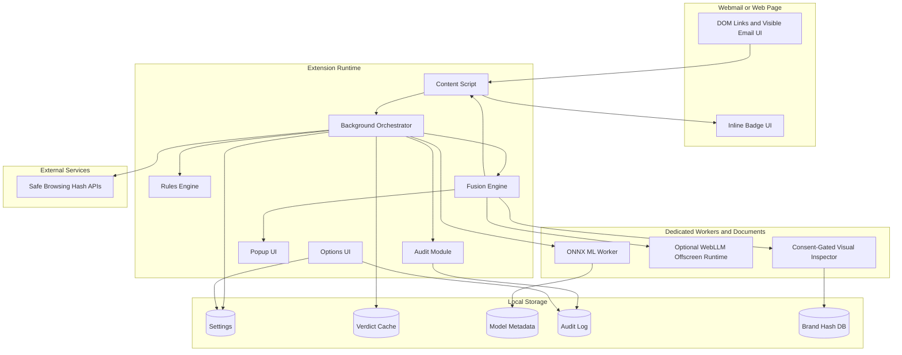
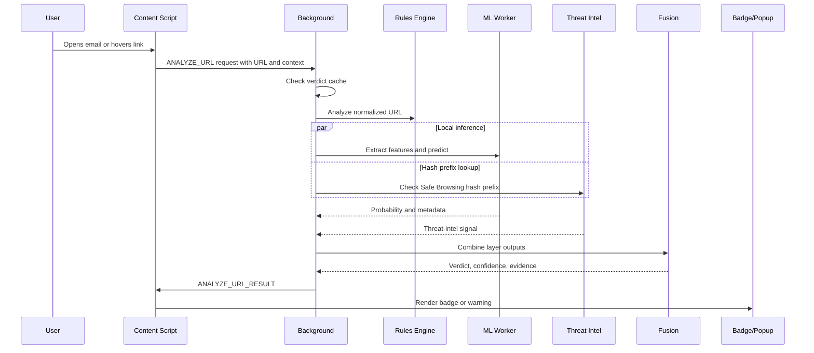

# Architecture Overview

## Architectural Goal

Aegis Gorgon should behave like a lightweight browser extension while internally following a security-product architecture: clear trust boundaries, typed contracts, local-first processing, centralized network auditing, and independent detection layers whose evidence can be inspected.

## Main Components

| Component | Runtime | Responsibility | Privacy Notes |
| --- | --- | --- | --- |
| Content scripts | Isolated extension world inside Gmail, Outlook, and web pages | Extract visible links, observe DOM changes, render inline badges and tooltips, send analysis requests. | Must not transmit email content. Should not run heavy detection. |
| Background service worker | Extension background | Orchestrates analysis, owns message handlers, manages cache, calls workers, records audit events. | All network calls must pass through audited network wrapper. |
| Rules engine | Background or dedicated module | Runs deterministic URL heuristics. | Local only. |
| ML worker | Web Worker | Loads ONNX model, performs local inference, returns probability and feature metadata. | Local only. Feature vectors must not leave device. |
| Threat-intelligence module | Background service worker | Maintains Safe Browsing hash-prefix data and performs privacy-preserving lookups. | Sends only hash-prefix requests, never full URLs. |
| Explanation engine | Offscreen document or worker | Runs template fallback or optional WebLLM explanation from structured signals. | No raw email content in prompts. |
| Visual inspector | Consent-gated offscreen document | Renders or analyzes suspect pages for brand impersonation. | Disabled by default for unopened email links because remote rendering can contact the target origin. |
| Popup UI | Extension page | Shows protection state, recent verdicts, layer breakdown, and explanation. | Reads local state only. |
| Options UI | Extension page | Settings, layer toggles, whitelist, audit log, privacy verifier. | Telemetry opt-in only. |
| Storage | `chrome.storage.local` and IndexedDB | Settings, verdict cache, model metadata, pHash DB, audit logs, training progress. | Local retention limits required. |

## Component Diagram

## Runtime Flow

## Module Boundaries

Content scripts:

- May read anchor `href` values and visible DOM needed for badge placement.
- May use a `MutationObserver` to track Gmail or Outlook SPA changes.
- Must send only minimal context: URL, source surface, tab ID, element correlation ID.
- Must not send the email body, visible email text, or full message headers.

Background orchestrator:

- Owns the analysis lifecycle.
- Enforces cache and timeout behavior.
- Starts rules, ML, and threat-intel work in parallel where possible.
- Calls visual inspection only when the settings and consent model allow it.
- Emits audit records for all network calls.

Workers and offscreen documents:

- Are used for CPU, GPU, or DOM-isolated work that should not block UI.
- Must have explicit message contracts.
- Must return typed errors instead of throwing raw exceptions across the message boundary.

Storage:

- Settings live in `chrome.storage.local`.
- Larger or indexed data lives in IndexedDB.
- Retention is explicit: verdict cache and audit log default to 24 hours unless the user changes settings.

## Failure Behavior

The system should fail open for normal browsing but fail closed for high-confidence known phishing:

- If rules fail, return `unknown` for Layer 1 and continue other layers.
- If ML model fails to load, use rules plus threat intelligence and show an ML unavailable indicator.
- If threat-intelligence API is unavailable, do not block solely because of network failure.
- If Safe Browsing returns a confirmed malicious match, final verdict must be at least `suspicious` and usually `phishing`.
- If LLM fails, use deterministic template explanations.
- If visual inspection is unavailable, omit the layer rather than silently pretending it passed.

## Performance Strategy

- Normalize and hash URLs once per analysis.
- Cache verdicts by canonical URL hash with a short TTL.
- Run rules synchronously because they should be sub-10 ms.
- Run ML in a worker.
- Run threat-intelligence lookup in parallel with ML.
- Defer LLM explanation until the user requests details.
- Defer visual inspection until the verdict is suspicious enough and consent/settings allow it.

## Security Strategy

- Centralize all network access.
- Treat every scanned URL as sensitive.
- Avoid executing remote scripts from suspect pages.
- Use strict Content Security Policy for extension pages and offscreen documents.
- Avoid remote executable code.
- Keep model and data assets versioned and integrity-checked.
- Keep UI injection minimal and namespaced to avoid breaking webmail clients.

## Architectural Constraints

- Manifest V3 service workers can be suspended. Long-running state must be persisted or recoverable.
- Extension store policies may restrict remotely hosted executable code. Models and data files should be treated as data assets, not dynamic code.
- Gmail and Outlook DOM structures are unstable. Content scripts must be resilient and tested against fixtures.
- WebGPU availability varies. LLM must be optional.
- Remote page rendering conflicts with the strongest privacy story unless consent-gated.
