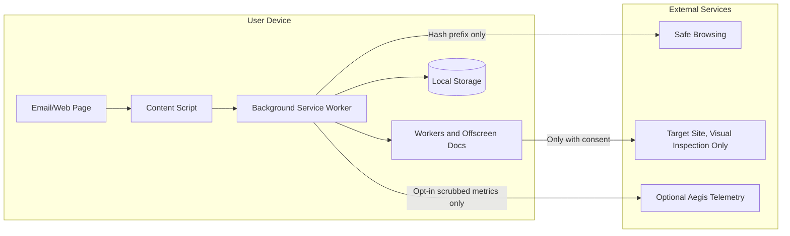

# Privacy And Threat Model

## Privacy Goal

Aegis Gorgon must protect users from phishing without becoming a sensitive-data collection point. The extension should be designed so that a user, reviewer, or judge can verify that email content stays local.

## Data Classification

| Data | Sensitivity | Default Location | May Leave Device? |
| --- | --- | --- | --- |
| Email body | Highly sensitive | Content script memory only | No |
| Sender and recipient identity | Highly sensitive | Content script memory only if visible | No |
| Full scanned URL | Sensitive | Background memory and local cache hash | No to Aegis services; no to threat-intel services; target-origin request only with explicit visual-inspection consent |
| Canonical URL hash | Sensitive derived data | Local cache | No, except prefix flow described below |
| Safe Browsing hash prefix | Pseudonymous derived data | Background | Yes, only for threat-intel lookup |
| ML feature vector | Sensitive derived data | Worker memory | No |
| LLM prompt and response | Sensitive derived data | Local LLM runtime and local cache if enabled | No |
| Rendered screenshot | Sensitive | Visual inspector memory | No |
| Verdict | Low to moderate sensitivity | Local storage | No by default |
| Audit log | Moderate sensitivity | IndexedDB | Export only by user action |
| Telemetry | Optional | Local until opt-in upload | Yes only if opt-in and scrubbed |

## Trust Boundaries



## Non-Negotiable Privacy Requirements

- Raw email body must never be sent through extension network calls.
- Full scanned URLs must not be sent to Aegis-controlled services.
- Safe Browsing integration must use hash-prefix privacy-preserving flow, not full URL lookup.
- LLM explanations must be local or deterministic templates.
- Screenshots must never be uploaded.
- Telemetry must default off.
- Network calls must be centrally wrapped and audited.
- The options page must expose a privacy audit log.
- The product must avoid vague claims such as "nothing leaves device" when Safe Browsing hash prefixes or consented visual inspection are enabled.

## Threats And Mitigations

| Threat | Risk | Mitigation |
| --- | --- | --- |
| Extension leaks email content through telemetry | Severe privacy breach | Telemetry off by default; scrubbed schema; no content fields; tests inspect payloads. |
| Developer accidentally uses Safe Browsing Lookup API with full URLs | Severe privacy breach | ADR mandates hash-prefix flow; wrapper API disallows full URL request body; privacy verifier checks network payloads. |
| LLM prompt includes email body | Severe privacy breach | Prompt builder accepts only typed signal objects; no raw content parameter exists. |
| Visual inspector contacts phishing host automatically | Privacy and safety risk | Disabled by default for unopened links; explicit consent; audit event; warning in UI. |
| Content script breaks Gmail or reads too much DOM | Product and privacy risk | Limit selectors to links and badge anchors; use fixtures; avoid collecting message text. |
| Model file tampering | Security risk | Version model artifacts; store hash; verify before loading. |
| Malicious page interferes with badge UI | Security/usability risk | Use isolated content-script world, Shadow DOM, namespaced CSS, and defensive rendering. |
| Service worker suspension loses in-flight analysis | Reliability risk | Persist state needed for recovery; use request IDs and idempotent retries. |
| Local cache stores sensitive URLs | Privacy risk | Store hashed canonical URL as key; truncate display values; TTL eviction. |
| False positives condition users to ignore warnings | Product risk | Use suspicious vs phishing distinction; require strong evidence for blocking UI. |

## Network Policy

Every extension network call must go through a function equivalent to:

```ts
auditedFetch({
  url,
  method,
  purpose,
  dataCategory,
  body,
  allowSensitiveData: false,
});
```

The wrapper must:

- Reject request bodies that contain raw scanned URLs unless the call is explicitly categorized as user-consented target-origin inspection.
- Reject email body fields at the type level.
- Record timestamp, destination hostname, purpose, request byte count, response byte count, status, and data category.
- Store audit records locally with a 24-hour TTL.
- Support a test mode used by the privacy verifier.

## Privacy Verifier Requirements

The one-click verifier should:

1. Clear the audit log.
2. Run a known fixture email through analysis.
3. Trigger rules, ML, Safe Browsing test lookup, and template explanation.
4. Optionally run LLM and visual tests only if the user enables them.
5. Show each network call.
6. Assert that forbidden data categories were not sent.
7. Export a local JSON proof if the user chooses.

Forbidden in verifier output:

- Email body text.
- Full scanned URL in network payloads.
- Sender or recipient.
- Screenshot data.
- LLM prompt containing raw email content.
- ML feature vector upload.

## Consent Model

Default enabled without extra consent:

- URL extraction from visible page links.
- Local rules.
- Local ML.
- Hash-prefix threat-intelligence lookup if configured during setup.
- Template explanation.
- Local audit logging.

Requires explicit setting or action:

- WebLLM model download because it can consume significant storage.
- Visual inspection because it may contact the target origin.
- Any telemetry.
- Exporting audit logs.

## Compliance-Oriented Notes

Aegis Gorgon should be positioned as data-minimizing software, not as a compliance guarantee by itself. Documentation and UI should be clear that:

- The product avoids collecting email content.
- Users and organizations remain responsible for their own regulatory obligations.
- Enterprise telemetry must be governed by employee consent, policy, and retention controls.
